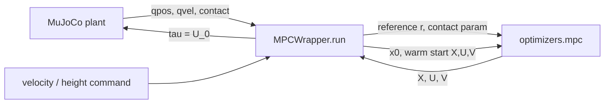
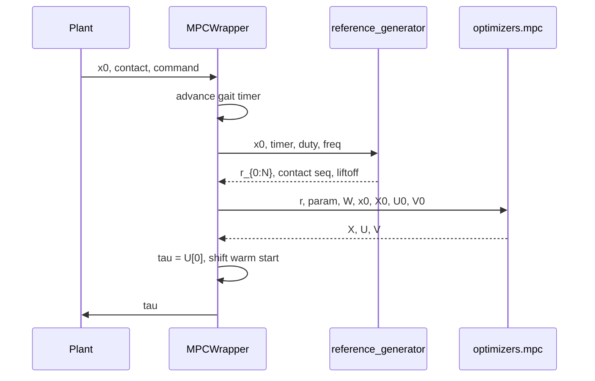
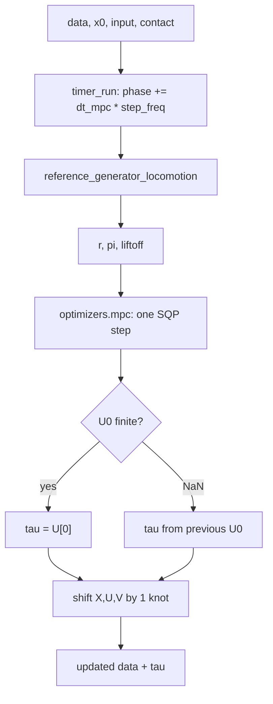
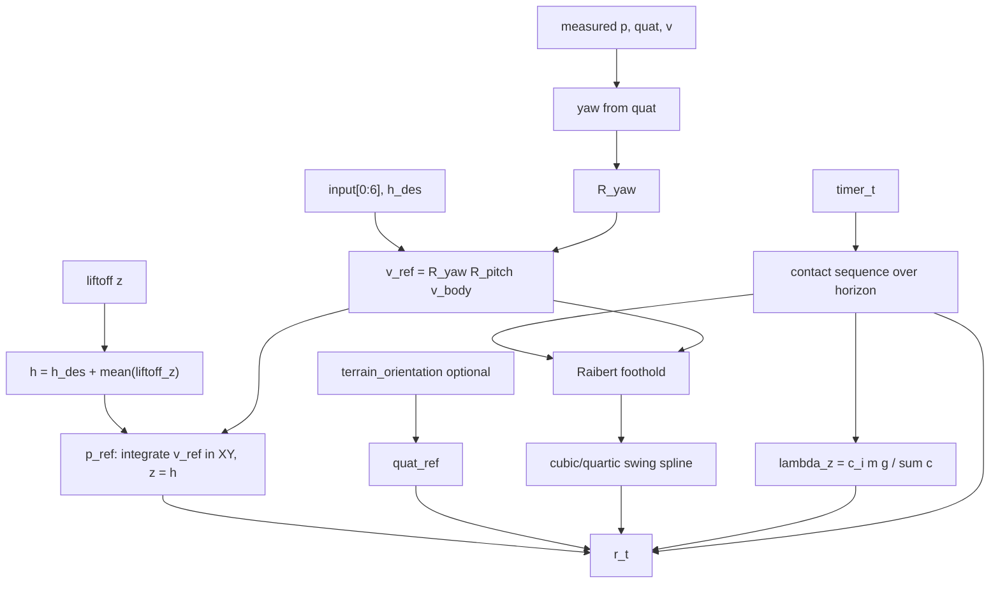
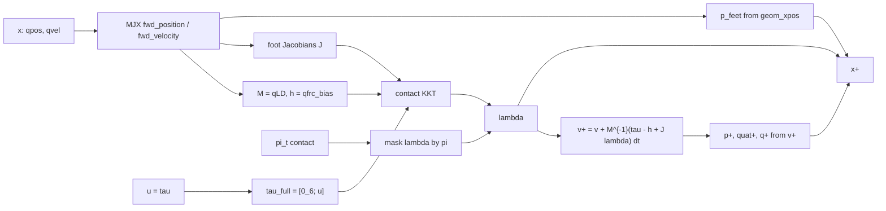
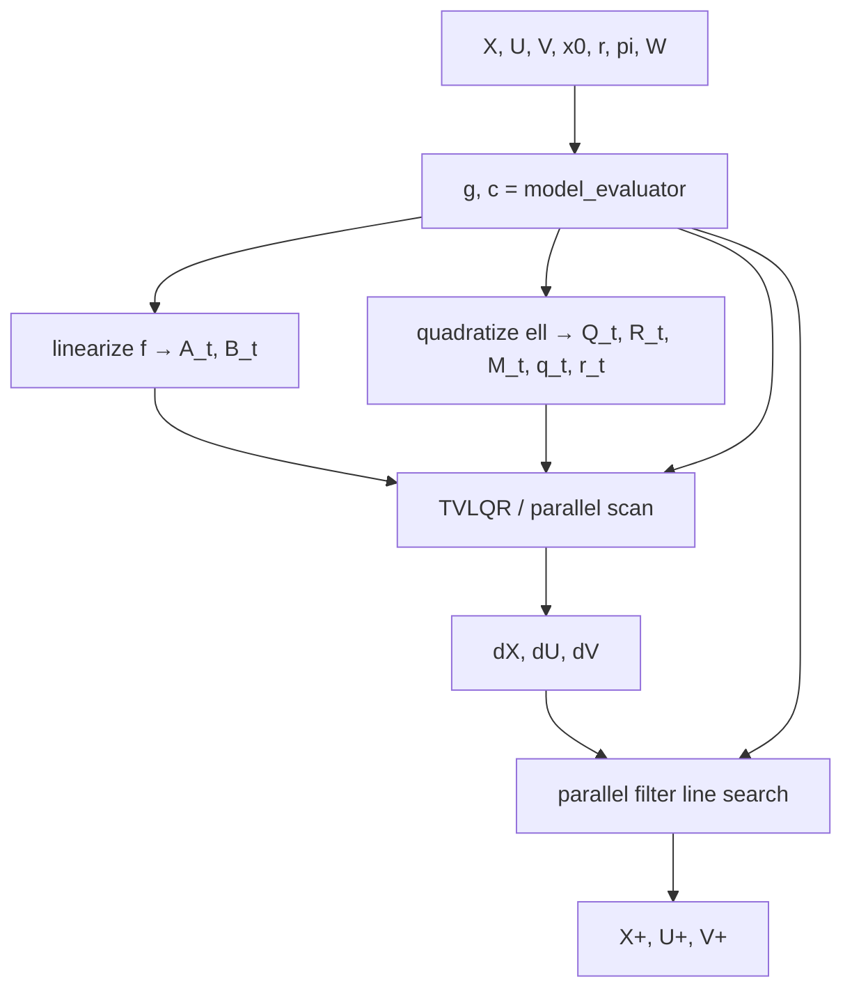

# Quadruped whole-body MPC

This note walks through the **online locomotion MPC** as implemented in this repo: how a measured robot state becomes a torque command, and the mathematics of the three layers involved.


| Layer                     | Code                                                                | Role                                                  |
| ------------------------- | ------------------------------------------------------------------- | ----------------------------------------------------- |
| Receding-horizon wrapper  | `mpx/utils/quad_utils_locomotion/mpc_wrapper_locomotion.py`         | Timer, reference, one SQP step, warm-start shift      |
| Gait / tracking reference | `mpx/utils/quad_utils_locomotion/reference_generator_locomotion.py` | Contact sequence, footholds, swing splines, GRF guess |
| OCP solver                | `mpx/jax_ocp_solvers/`                                              | Multiple-shooting SQP with parallel TVLQR KKT solve   |


Related: gait knobs (`timer_t`, `duty_factor`, `step_freq`, cost `W`) are documented in `[gait_duty_factor_mpc_gains.md](gait_duty_factor_mpc_gains.md)`. How MuJoCo realizes contact forces (geom μ, `solref`/`solimp`, `min(foot, floor)`) is in `[mujoco_contact_friction.md](mujoco_contact_friction.md)`. The solver paper is [arXiv:2506.07823](https://arxiv.org/abs/2506.07823). Go2 defaults used below: N=25, \Delta t=0.02\mathrm{s}, MPC rate 50\mathrm{Hz}, n_j=12 joints, n_c=4 feet.

---


## 1. Receding-horizon picture

At every MPC tick the controller solves a finite-horizon optimal control problem (OCP) from the **current measured state**, applies only the **first** control, then shifts the solution to warm-start the next tick.




Horizon length in time is T = N\Delta t = 0.5\mathrm{s}. The MPC rate equals the OCP discretization (50\mathrm{Hz}), so the receding shift is one knot:


\texttt{shift} = \frac{1}{\Delta t \cdot f_{\mathrm{mpc}}} = 1.


One **online** call of `optimizers.mpc` performs **a single SQP iteration** (linearize → TVLQR → filter line search). Tracking over time comes from repeating that iteration every 20\mathrm{ms} with a shifted warm start, not from iterating SQP to full convergence at each tick.




---


## 2. Variables


### 2.1 Whole-body state x \in \mathbb{R}^{n}

With `grf_as_state=True` (Go2 locomotion):

$$n = 13 + 2 n_j + 6 n_c = 61.$$

```math
x =
\begin{bmatrix}
p \in \mathbb{R}^{3}; 
q_{\mathrm{quat}} \in \mathbb{R}^{4}; 
q \in \mathbb{R}^{12};
\dot p \in \mathbb{R}^{3} ;
\omega \in \mathbb{R}^{3} ;
\dot q \in \mathbb{R}^{12} ;
p_{\mathrm{feet}} \in \mathbb{R}^{12} ;
\lambda \in \mathbb{R}^{12};
\end{bmatrix};
```

```math
\begin{bmatrix}
\text{base position} 
\text{base quaternion }(w,x,y,z) 
\text{joint angles} 
\text{base linear velocity} 
\text{base angular velocity} 
\text{joint velocities} 
\text{FL, FR, RL, RR positions} 
\text{GRFs (XYZ per foot)}
\end{bmatrix}.
```

Control is joint torque only:


u = \tau \in \mathbb{R}^{12}, \qquad m = n_j.


The floating-base wrench is **not** a decision variable. It is produced inside the dynamics by the contact model (Section 6).

### 2.2 Trajectories the solver sees


| Symbol | Shape           | Meaning                                                    |
| ------ | --------------- | ---------------------------------------------------------- |
| X      | (N+1)\times n   | multiple-shooting states x_0,\ldots,x_N                    |
| U      | N \times m      | controls u_0,\ldots,u_{N-1}                                |
| V      | (N+1)\times n   | dynamics multipliers (dual of shooting defects)            |
| r      | (N+1)\times n_r | tracking reference (Section 5)                             |
| \pi    | (N+1)\times 4   | contact flags passed as **parameters** (not decision vars) |
| W      | cost weights    | diagonal blocks in `Go2Locomotion.W`                       |


Contact \pi_t \in 0,1^4 is **fixed** over the horizon by the gait timer. The OCP does not choose when feet lift or land.

### 2.3 Command vector `input`

Used only by the reference generator (world-frame twist + height):


\texttt{input} =
\bigl[v_x, v_y, v_z, \omega_x, \omega_y, \omega_z, h_{\mathrm{des}}\bigr]^\top.


---


## 3. One tick of `MPCWrapper`

`MPCWrapper._run_impl` is a pure JAX step on an `MPCData` pytree (`X0, U0, V0`, gait timer, liftoff).




### 3.1 Gait clock

Each foot has a phase \phi_i \in [0,1). With \Delta t_{\mathrm{mpc}} = 1/f_{\mathrm{mpc}}:


\phi_i \leftarrow \phi_i + \Delta t_{\mathrm{mpc}} f_{\mathrm{step}},
\qquad
\phi_i \leftarrow \phi_i - 1 \quad \text{if } \phi_i > 1,


c_i = \mathbf{1}\phi_i < d, \qquad d = \texttt{dutyfactor}.


`timer_t` is the initial phase offset (trot: [0.5, 0, 0, 0.5]). The wrapper advances \phi **once per MPC tick**; the reference generator then **replays** the same clock over the N+1 knots with the OCP step \Delta t.

### 3.2 Warm start

After a successful solve, trajectories are shifted by `shift` knots and the last knot is repeated:


U^+*{0:N-\sigma-1} = U*{\sigma:N-1},\quad
U^+*{N-\sigma:N-1} = U*{N-1},


and likewise for X and V. If U contains NaNs, the wrapper tiles the measured x_0 / u_{\mathrm{ref}} instead.

The first applied command is u_0 = U[0]. (The older commented wrapper also exported q, \dot q from X[1] for a low-level PD; the current `MPCWrapper.control_output` returns torque only.)

---


## 4. Reference generator

`reference_generator_locomotion` builds, at the **current** x and command, a kinematic plan the QP should track. It does not simulate rigid-body dynamics.

Return value (concatenated along the last axis), length n_r = 53 for Go2:


r_t =
\bigl[
p^{\mathrm{ref}},
q_{\mathrm{quat}}^{\mathrm{ref}},
q^{\mathrm{ref}},
\dot p^{\mathrm{ref}},
\omega^{\mathrm{ref}},
p_{\mathrm{feet}}^{\mathrm{ref}},
\pi_t,
\lambda^{\mathrm{ref}}
\bigr]_t.


The second return is \pi_{0:N} (also the dynamics **parameter**). The third is the updated liftoff positions.




### 4.1 Base pose and twist

Yaw from the measured quaternion:


\psi = \mathrm{atan2}\bigl(2(w z + x y), 1 - 2(y^2 + z^2)\bigr),
\qquad
R_\psi =
\begin{bmatrix}
\cos\psi & -\sin\psi & 0 
\sin\psi & \cos\psi & 0 
0 & 0 & 1
\end{bmatrix}.


Proprioceptive height (commanded clearance above the last stance plane):


h = \texttt{input}[6] + \frac{1}{n_c}\sum_{i=1}^{n_c} z_i^{\mathrm{liftoff}}.


The measured p_z is **replaced** by h when building the XY reference, so the MPC tracks a height relative to the feet, not the raw odometry z.

If `use_terrain_estimation` is on, \texttt{quatref} is a single terrain quaternion from `terrain_orientation(liftoff, R_\psi)` (plane from front–hind liftoff vectors; roll is locked to yaw so only pitch follows the slope), tiled over the horizon. Otherwise \texttt{quatref} = (1,0,0,0).

Pitch of that reference quaternion gives R_\theta. Body-frame commanded linear velocity is rotated into the world:


v^{\mathrm{ref}} = R_\psi R_\theta \texttt{input}[0:3],
\qquad
\omega^{\mathrm{ref}} = \texttt{input}[3:6].


Straight-line base plan (no curvature preview):


\begin{aligned}
p_x^{\mathrm{ref}}(t) &= p_x + t\Delta t v_x^{\mathrm{ref}}, 
p_y^{\mathrm{ref}}(t) &= p_y + t\Delta t v_y^{\mathrm{ref}}, 
p_z^{\mathrm{ref}}(t) &= h, 
\dot p^{\mathrm{ref}}(t) &= v^{\mathrm{ref}}, \qquad
\omega^{\mathrm{ref}}(t) = \omega^{\mathrm{ref}}.
\end{aligned}


Joint reference q^{\mathrm{ref}} is the constant nominal pose `q0` (not an IK of the swing spline). Foot tracking, not joint tracking, is what shapes swing.

Nominal foot locations in the world, yawed with the base:


p_{0,i}^{\mathrm{proj}} = p + R_\psi p_{0,i},


where p_{0,i} is `p_legs0` (hip-centered rest stance in the base XY).

### 4.2 Contact sequence and early contact

For each horizon knot, `timer_run` is applied with OCP \Delta t. Stance iff \phi_i < d.

Early contact (measured foot still on the ground after the timer already requested swing, and the phase is in the **second half** of swing):


e_i = \mathbf{1}\bigl \pi_i^{\mathrm{des}}=0 \wedge c_i^{\mathrm{meas}}=1 \wedge \phi_i > \tfrac12 + \tfrac12 d \bigr.


If e_i=1, that foot is treated as planted: the spline is skipped and the previous foot position is held. This avoids commanding a swing through the terrain after a late/early touchdown.

Liftoff is latched on a falling contact edge:


\pi_{t,i}=0 \wedge \pi_{t-1,i}=1
\quad\Longrightarrow\quad
p_i^{\mathrm{liftoff}} \leftarrow p_{i,t-1}.


### 4.3 Raibert foothold

For horizontal axes a \in x,y:

# 
f_{i,a}

\underbrace{\tfrac12 v_a^{\mathrm{ref}} \frac{d}{f_{\mathrm{step}}}}*{\text{stance-centered stride}}
+
\underbrace{\sqrt{\frac{h*{\mathrm{des}}}{g}}(\dot p_a - v_a^{\mathrm{ref}})}*{\text{velocity feedback}}
+
p*{0,i,a}^{\mathrm{proj}}.


The first term is half of the distance travelled during stance (d / f_{\mathrm{step}} is stance duration). The second is a capture-point / Raibert correction with time constant \sqrt{h/g}. There is **no** z foothold: the swing returns to the liftoff height.

### 4.4 Swing interpolation

Let s \in [0,1] be the fraction of **swing** elapsed:


s = \frac{\phi - d}{1-d}.


Horizontal cubic with start velocity v_0 and **zero** terminal velocity (so the foot arrives quietly):


\begin{aligned}
\gamma(s)
&= a_0 + a_1 s + a_2 s^2 + a_3 s^3, 
a_0 &= p^{\mathrm{liftoff}}, \quad
a_1 = v_0, 
a_2 &= 3(f - p^{\mathrm{liftoff}}) - 2 v_0, \quad
a_3 = v_0 - 2(f - p^{\mathrm{liftoff}}).
\end{aligned}


Boundary check: \gamma(0)=p^{\mathrm{liftoff}}, \gamma(1)=f, \gamma'(0)=v_0, \gamma'(1)=0.

The start velocity is a **retraction** opposite to travel, of size `clearence_speed` (default 0.2\mathrm{m/s}):


v_0 = -\frac{v^{\mathrm{ref}}}{v^{\mathrm{ref}}+\varepsilon} v_{\mathrm{clear}}.


Vertical motion is a quartic bump from liftoff z back to the same z, peaking near `step_height`, with a fixed initial upward speed 0.7\mathrm{m/s} in the spline coefficients.

During stance (\pi_i=1) or early contact, p_{\mathrm{feet}}^{\mathrm{ref}} is held at the previous knot (stance feet do not slide in the reference).

### 4.5 GRF reference

Only the vertical component is filled; laterals stay 0:

# 
\lambda_{i,z}^{\mathrm{ref}}(t)

\pi_{t,i}
\frac{m g}{\sum_j \pi_{t,j} + \varepsilon}.


Stance feet share weight equally. This is a **soft** target in the cost (`Q_grf` is small, 10^{-2}); the dynamics compute the actual \lambda.

---


## 5. Optimal control problem

At each tick the solver approximately solves the multiple-shooting problem


\begin{aligned}
\min_{X,U}
\quad
&
\sum_{t=0}^{N-1} \ell(x_t, u_t; r_t, W)
+
\ell_N(x_N; r_N, W) 
\mathrm{s.t.}
\quad
&
x_0 = x_{\mathrm{meas}}, 
&
x_{t+1} = f(x_t, u_t; \pi_t),
\qquad t = 0,\ldots,N-1.
\end{aligned}


Inequalities (friction cone, torque limits, joint-speed limits) are **not** hard constraints. They enter \ell as scalar barriers (Section 7). Contact flags \pi_t are parameters inside f and \ell.

Defects used by the SQP (from `model_evaluator_helper`):


c_0 = x_{\mathrm{meas}} - x_0,
\qquad
c_{t+1} = f(x_t,u_t;\pi_t) - x_{t+1}.


The Lagrangian of the equality-constrained NLP is

# 
\mathcal{L}(X,U,V)

\sum_{t=0}^{N} \ell_t
+
v_0^\top (x_{\mathrm{meas}} - x_0)
+
\sum_{t=0}^{N-1} v_{t+1}^\top \bigl(f(x_t,u_t) - x_{t+1}\bigr).


(`kkt_helpers.compute_search_direction_kkt` writes this form explicitly. `lagrangian()` in `optimizers.py` is the stagewise version used for autodiff of \nabla_x\mathcal{L}, \nabla_u\mathcal{L}.)

---


## 6. Discrete dynamics f

`quadruped_wb_dynamics` is a **semi-implicit Euler** step of the MJX rigid body, with an explicit linear contact solve. Foot positions and GRFs in x^+ are outputs of this model, not independent integrators.




### 6.1 Unconstrained rigid body

Let q_{\mathrm{pos}} = (p, q_{\mathrm{quat}}, q) and v = (\dot p, \omega, \dot q). MJX gives the mass-matrix Cholesky factor L (`qLD`) and bias h (`qfrc_bias`, Coriolis + gravity). With floating-base torque padding:


\tilde\tau = \begin{bmatrix} 0_6  u \end{bmatrix} \in \mathbb{R}^{18}.


Unconstrained inverse dynamics would be M \dot v = \tilde\tau - h.

### 6.2 Contact as a velocity-level constraint

Stack the four translational Jacobians J_i = \partial p_i / \partial v, so J \in \mathbb{R}^{18 \times 12} in the code (`mjx.jac` then concatenate on `axis=1`). Foot velocity:


\dot g = J^\top v \in \mathbb{R}^{12}.


A Baumgarte term on **velocity only** (no positional P-term), with \alpha = 25:


b = -2\alpha \dot g.


The linearized rigid constraint J^\top \dot v = b plus the unconstrained EoM yields the condensed positive-definite system

# 
\bigl(J^\top M^{-1} J\bigr) \lambda

- J^\top M^{-1}(\tilde\tau - h) + b.


Solve for \lambda \in \mathbb{R}^{12} (unilateral friction is **not** in this QP; it is only a cost barrier). Then mask by the planned contact:


\lambda \leftarrow
\bigl(
\pi_0 \lambda_{\mathrm{FL}},
\pi_1 \lambda_{\mathrm{FR}},
\pi_2 \lambda_{\mathrm{RL}},
\pi_3 \lambda_{\mathrm{RR}}
\bigr).


Swing feet contribute zero force. There is no complementarity; a planned stance foot will produce whatever \lambda the linear system asks for, including possible tension if the barrier does not prevent it.

### 6.3 Integration


\begin{aligned}
v^+ &= v + M^{-1}\bigl(\tilde\tau - h + J\lambda\bigr)\Delta t, 
p^+ &= p + v^+*{0:3}\Delta t, 
q*{\mathrm{quat}}^+ &= \mathrm{quatintegrate}(q_{\mathrm{quat}}, v^+*{3:6}, \Delta t), 
q^+ &= q + v^+*{6:18}\Delta t.
\end{aligned}


p_{\mathrm{feet}}^+ is **forward kinematics** at the **current** configuration (before this step’s q^+), and \lambda is appended as state. So the next knot’s feet come from FK of that knot’s q_{\mathrm{pos}}, not from integrating \dot g.

---


## 7. Stage cost \ell

`quadruped_wb_obj(..., swing_tracking=True, ...)` (Go2 locomotion). All quadratic terms are \tfrac12 of the usual e^\top W e because the function returns `0.5 * stage_cost`. Quaternion error is the 3-vector `quat_sub`, so W’s rotation block is 3\times 3, not 4\times 4.

Let \tilde q_{\mathrm{quat}} = \mathrm{quatsub}(q_{\mathrm{quat}}, q_{\mathrm{quat}}^{\mathrm{ref}}). With locomotion `swing_tracking=True`, **every** foot is tracked (stance and swing). Then


\begin{aligned}
\ell_t
&=
p - p^{\mathrm{ref}}*{Q_p}^2
+
\tilde q*{\mathrm{quat}}*{Q*{\mathrm{rot}}}^2
+
q - q^{\mathrm{ref}}*{Q_q}^2 
&\quad +
\dot p - v^{\mathrm{ref}}*{Q_{\dot p}}^2
+
\omega - \omega^{\mathrm{ref}}*{Q*\omega}^2
+
\dot q*{Q*{\dot q}}^2 
&\quad +
p_{\mathrm{feet}} - p_{\mathrm{feet}}^{\mathrm{ref}}*{Q*{\mathrm{leg}}}^2
+
\tau*{Q*\tau}^2
+
\lambda - \lambda^{\mathrm{ref}}*{Q*\lambda}^2 
&\quad +
\sum_i \psi(\mu \lambda_{i,z} - \lambda_{i,xy})\cdot \pi_{t,i}
+
\sum \psi(\text{torque limits})
+
\sum \psi(\text{joint-speed limits}).
\end{aligned}


The terminal cost \ell_N drops \tau, \lambda, feet, and barriers (only base / joints / velocities).

Go2 locomotion weights (see also the gait note): Q_p = \mathrm{diag}(0,0,10^4) so XY position is free and the robot follows **velocity**; Q_{\mathrm{rot}} has zero yaw so heading is commanded through \omega_z.

### 7.1 Soft friction cone

For each foot, with \mu = 0.5:


h_i = \mu \lambda_{i,z} - \sqrt{\lambda_{i,x}^2 + \lambda_{i,y}^2 + \varepsilon}.


Penalty \psi is a clipped log/quadratic barrier (`penalty`): log when h > \sigma, quadratic extension when the cone is violated or tight. It is multiplied by \pi_{t,i} so swing feet are not forced into the cone. This is **not** a guaranteed friction constraint. The MuJoCo plant uses a different μ (`min` of the two geoms); see [mujoco_contact_friction.md](mujoco_contact_friction.md).

### 7.2 Torque and speed barriers

Torque boxes \lvert \tau_j \rvert \le 44\mathrm{Nm} and \lvert \dot q_j \rvert \le 10\mathrm{rad/s} are encoded as two-sided inequalities and passed through the same \psi.

---


## 8. SQP in `jax_ocp_solvers`

`optimizers.mpc` is the locomotion solver (`solver_mode = "primal_dual"`). FDDP (`fddp_mpc`) exists but is not the Go2 default.

One call:

1. Evaluate g = \sum \ell_t and defects c.
2. Form a **quadratic–linear** model of the NLP (Newton / Gauss–Newton on \mathcal{L}).
3. Solve that LQ subproblem with **time-varying LQR** (primal) and recover duals.
4. Take a step X \leftarrow X + \alpha dX (etc.) with a **filter line search**.




Go2 sets `hessian_approx = None`, so Q,R,M come from JAX Hessians of the **scalar** \ell (`trajax.quadratize`), not from the Gauss–Newton residual Jacobian in `quadruped_wb_hessian_gn`.

### 8.1 Linear–quadratic subproblem

Linearized dynamics around (X,U):

# 
\delta x_{t+1}

A_t \delta x_t
+
B_t \delta u_t
+
c_{t+1},
\qquad
A_t = D_x f,\quad
B_t = D_u f.


The affine term c_{t+1} is the current shooting defect, so a full step \alpha=1 would satisfy the linearized dynamics. The initial-state defect is the TVLQR initial condition \delta x_0 = c_0.

Quadratic model of \ell (plus a small \varepsilon I on Q and R):


\begin{aligned}
\delta\ell_t
&=
\tfrac12 \delta x^\top Q_t \delta x
+
q_t^\top \delta x
+
\tfrac12 \delta u^\top R_t \delta u
+
r_t^\top \delta u
+
\delta x^\top M_t \delta u.
\end{aligned}


Gradients q_t, r_t are \nabla_x \mathcal{L} and \nabla_u \mathcal{L} (cost plus linearized dynamics contracted with V), so the LQ problem is a **Newton step on the KKT system**, not a pure iLQR cost-to-go on \ell alone.

The LQ problem is the discrete LQR


\begin{aligned}
\min_{\delta X, \delta U}
\quad
&
\sum_{t=0}^{N-1}
\delta\ell_t
+
\tfrac12 \delta x_N^\top Q_N \delta x_N

- q_N^\top \delta x_N 
\mathrm{s.t.}
\quad
&
\delta x_0 = c_0, 
&
\delta x_{t+1} = A_t \delta x_t + B_t \delta u_t + c_{t+1}.
\end{aligned}


### 8.2 Riccati / TVLQR (`primal_tvlqr.py`)

Backward Riccati: value V_t(\delta x) = \tfrac12 \delta x^\top P_t \delta x + p_t^\top \delta x. The stagewise control is affine,


\delta u_t = K_t \delta x_t + k_t.


`lqr_step` forms


\begin{aligned}
G &= R + B^\top P^+ B, 
H &= B^\top P^+ A + M^\top, 
h &= B^\top p^+ + B^\top P^+ c + r, 
K &= -G^{-1} H, \qquad k = -G^{-1} h,
\end{aligned}


then updates P,p. `tvlqr` scans this **backwards in time** (O(N) sequential).

`tvlqr_gpu` is the same LQ problem with an **associative scan** over a linearized two-point boundary-value factorization ([ScaLQR / parallel LQR](https://ieeexplore.ieee.org/document/9697418)), reducing span complexity to O(\log N) on GPU. That is the default (`limited_memory=False`). After the scan, K,k are recovered from P,p with the same G,H,h formulas.

Forward rollout (`rollout` / `rollout_gpu`) applies \delta u = K\delta x + k through the linearized dynamics to get \delta X, \delta U.

### 8.3 Dual update (`dual_tvlqr.py`)

Costate from the quadratic value:


\delta v_t = P_t \delta x_t + p_t.


This is the Newton step on the dynamics multipliers V.

### 8.4 Filter line search

`parallel_filter_line_search` tries a geometric grid of steps \alpha \in 1, 1/2, \ldots **in parallel** (default `num_alpha=11`). Acceptance follows a filter on


\phi = g = \sum \ell_t,
\qquad
\theta = c_2


rather than a single \ell_1 merit:

- if \theta is large: require \theta to decrease;
- if both \theta values are tiny and the predicted slope \sum q^\top dX + r^\top dU < 0: Armijo on \phi;
- otherwise: accept if **either** cost drops (relative to \theta) **or** infeasibility drops.

If no \alpha is accepted, the iterate is left unchanged (the wrapper then keeps the previous warm start / previous \tau if U is NaN).

### 8.5 What this is not

- Not DDP/FDDP unless `solver_mode="fddp"` (single shooting + nonlinear rollout).
- Not an interior-point solver on inequalities (`ip_mpc` exists but is unused here).
- Not a contact-implicit complementarity MPC: hybrid mode is **open-loop in \pi**, closed-loop only through state tracking and early-contact latching.

---


## 9. Closing the loop with the plant

```text
measured x0  ──►  r(x0, command, gait)  ──►  one SQP step  ──►  tau = U[0]
     ▲                                                                      │
     └──────────── MuJoCo step with tau  ◄──────────────────────────────────┘
```

Important separations:


| Quantity          | Who computes it      | Closed loop?                                                             |
| ----------------- | -------------------- | ------------------------------------------------------------------------ |
| Contact flags \pi | gait timer + duty    | open-loop schedule; early-contact can freeze a foot in the **reference** |
| Footholds / swing | Raibert + splines    | replanned every tick from current p,v                                    |
| GRF \lambda       | dynamics QP inside f | implicit function of x,u,\pi                                             |
| Torque \tau       | SQP decision         | yes, first knot applied                                                  |
| Base XY           | weakly / not in Q_p  | follows v^{\mathrm{ref}}, not a position setpoint                        |


Because \pi is a parameter, changing gait (`timer_t`, duty, frequency) changes **both** the reference the cost tracks **and** the contact Jacobian masking inside f. That is why duty / frequency / W have to stay consistent (see the gait note).

---


## 10. File map

```text
mpc_wrapper_locomotion.py
  build_solver_step  →  optimizers.mpc | fddp_mpc
  MPCWrapper.make_data / run / reset / _update_warm_start
  binds dynamics from config (quadruped_wb_dynamics)
  binds cost from config (quadruped_wb_obj)

reference_generator_locomotion.py
  reference_generator_locomotion   ← online WB locomotion
  reference_generator_srbd         ← centroidal variant
  whole_body_interface             ← optional Cartesian PD + J^T lambda (not the default wrapper path)

jax_ocp_solvers/jax_ocp_solvers/
  optimizers.py     mpc, line search, model_evaluator, compute_search_direction
  primal_tvlqr.py   Riccati, parallel scan, rollout
  dual_tvlqr.py     costate from (P, p, dX)
  kkt_helpers.py    dense KKT Newton (reference / tests)
  linalg_helpers.py PSD projection, LDLT / Cholesky

quadruped_dyn_models/
  models.py         f(x, u, t; pi)
  objectives.py     ell, barriers, optional GN Hessian
```

---


## 11. Dimensions cheat sheet (Go2 locomotion)


\begin{array}{c|c}
\hline
N, \Delta t, f_{\mathrm{mpc}} & 25, 0.02\mathrm{s}, 50\mathrm{Hz} 
\text{horizon time} & 0.5\mathrm{s} 
n, m & 61, 12 
X, U, V & (26\times 61), (25\times 12), (26\times 61) 
r_t & 53 \text{ (pose, twist, feet, }\pi, \lambda^{\mathrm{ref}}) 
\pi_t & 4 \text{ booleans, parameter of } f \text{ and } \ell 
\hline
\end{array}
